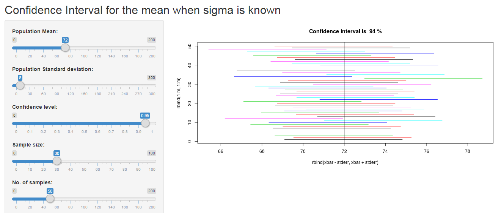
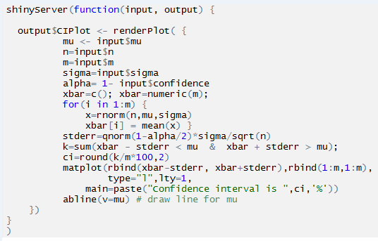
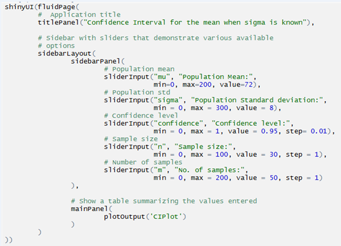

### Confidence Interval for mean when sigma is known

Applet: [http://msong727.shinyapps.io/Confidence_Interval] (http://msong727.shinyapps.io/Confidence_Interval)
  
This applet  simulates sampling from a population with a mean mu and a standard deviation sigma. For each sample, the confidence intervals on the mean are computed based on the sample mean and population sample standard deviation. 
The intervals for the various samples are displayed by horizontal lines as shown next slide. 

###  How to Use

Input variables are
  *      mu      : population mean
  *      sigma   : population standard deviation
  *      n       : sample size
  *      m       : number of samples
  *      Confidence Level : default 95%

---

## Confidence Interval Calculator

---

## server.R

---

## ui.R

